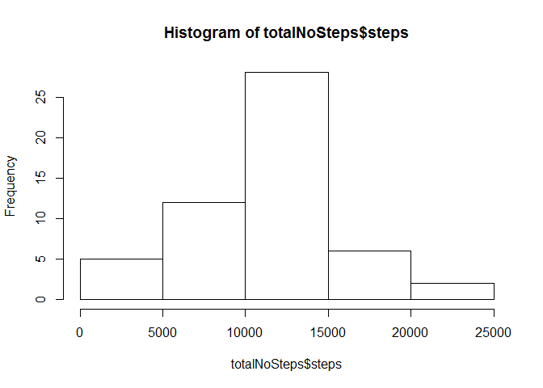
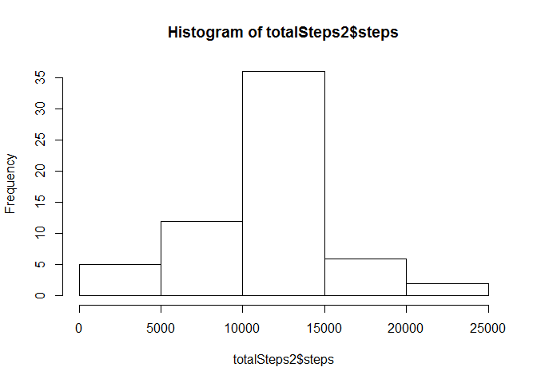

# Reproducible Research: Peer Assessment 1
setwd("C:/Users/Yuhanis/Documents/My Course/Data Science/e-ClassModule/Course5-Reproducible Research/RepData_PeerAssessment1")

## Loading and preprocessing the data

```r
unzip(zipfile = "activity.zip")
dtActivity <- read.csv("activity.csv")
```

## What is mean total number of steps taken per day?

```r
totalNoSteps <- aggregate(steps ~ date, data = dtActivity, sum, na.rm = TRUE)
hist(totalNoSteps$steps)
```

 


```r
mean(totalNoSteps$steps, na.rm = TRUE)
```

```
## [1] 10766.19
```


```r
median(totalNoSteps$steps)
```

```
## [1] 10765
```


## What is the average daily activity pattern?

```r
stepsInterval <- aggregate(steps ~ interval, data = dtActivity, mean, na.rm = TRUE)
plot(steps ~ interval, data = stepsInterval, type = "l")
```

 


```r
stepsInterval[which.max(stepsInterval$steps), ]$interval
```

```
## [1] 835
```


## Imputing missing values


```r
missing <- is.na(dtActivity$steps)
```


```r
interval2steps <- function(interval) {
    stepsInterval[stepsInterval$interval == interval, ]$steps
}
```


```r
activityFilled <- dtActivity  # Make a new dataset with the original data
count = 0  # Count the number of data filled in
for (i in 1:nrow(activityFilled)) {
    if (is.na(activityFilled[i, ]$steps)) {
        activityFilled[i, ]$steps <- interval2steps(activityFilled[i, ]$interval)
        count = count + 1
    }
}
cat("Total ", count, "NA values were filled.\n\r")
```

```
## Total  2304 NA values were filled.
## 
```


```r
totalSteps2 <- aggregate(steps ~ date, data = activityFilled, sum)
hist(totalSteps2$steps)
```

 


```r
mean(totalSteps2$steps)
```

```
## [1] 10766.19
```


```r
median(totalSteps2$steps)
```

```
## [1] 10766.19
```


## Are there differences in activity patterns between weekdays and weekends?

```r
activityFilled$day = ifelse(as.POSIXlt(as.Date(activityFilled$date))$wday%%6 == 
    0, "weekend", "weekday")
# For Sunday and Saturday : weekend, Other days : weekday
activityFilled$day = factor(activityFilled$day, levels = c("weekday", "weekend"))
```


```r
stepsInterval2 = aggregate(steps ~ interval + day, activityFilled, mean)
library(lattice)
xyplot(steps ~ interval | factor(day), data = stepsInterval2, aspect = 1/2, 
    type = "l")
```

 


